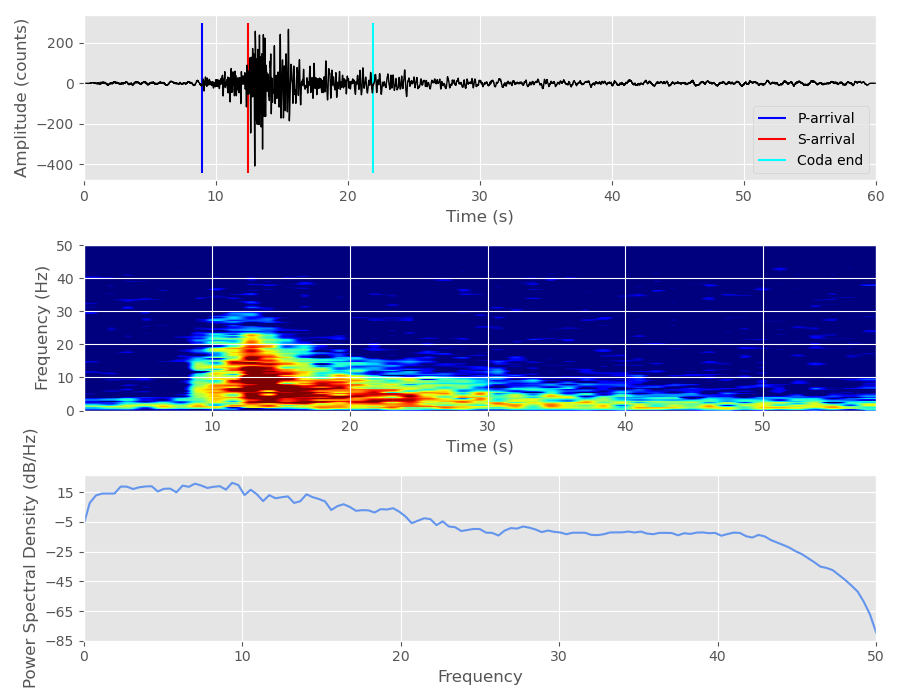
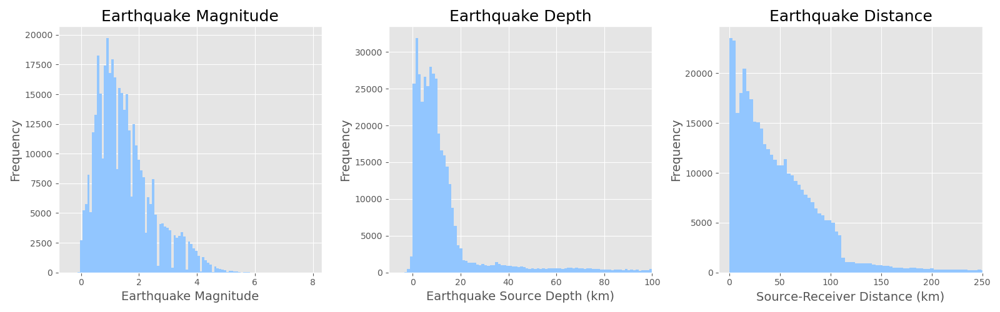
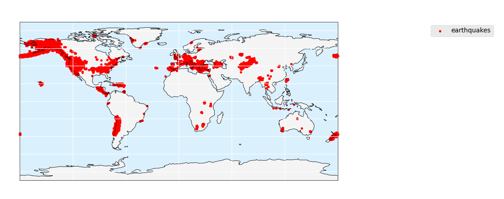
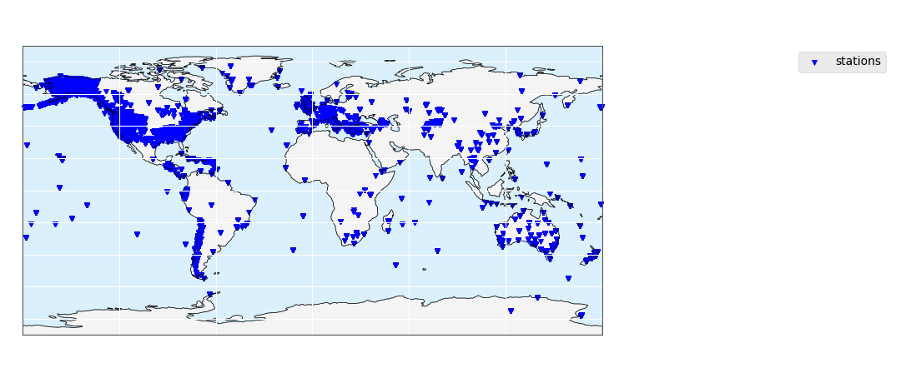
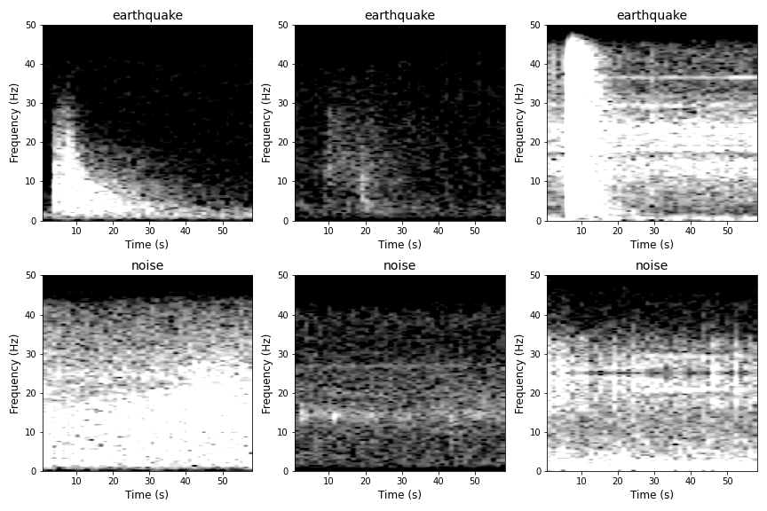

# Earthquake Classification using CNNs

## Introduction

The goal of this study is to train a convolutional neural network using over 600,000 seismic signal images, to classify signals into 'earthquake' and 'noise' categories. This study has potential applications for faster earthquake detection, as this CNN could be used to classify signals in near-real time. 

## Data

For this study, I used the STanford EArthquake Dataset (STEAD) (available at https://github.com/smousavi05/STEAD), a dataset containing 1.2 million seismic signals and corresponding metadata. STEAD is a high-quality global seismic dataset for which each signal has been classified as either:

1) Local earthquakes (where 'local' means that the earthquakes were recorded within 350 km from the seismic station) or 
2) Seismic noise that is free of earthquake signals. 

Earthquakes and their p-wave and s-wave arrival times in the STEAD dataset were classified 70% manually and 30% by an autopicker. The dataset also contained a .csv file with metadata for each seismic signal comprising 35 features, including:
* network code
* receiver code
* station location
* earthquake source location
* p-wave arrival time
* s-wave arrival time
* source magnitude
* source-reciever distance
* back-azimuth of arrival
* earthquake category (i.e., 'earthquake' or 'noise')
* etc.

Each seismic sample has 3 data channels of seismic data in .h5py format along with the metadata. The three channels correspond to the north-south, east-west, and vertical components of the seismogram (the amount of ground displacement measured on each of these axes by the instrument). Each sample is 60 seconds long and sampled at 100 Hz, for a total of 6000 samples per signal. Since the class balance of the full STEAD data is 235,426 noise samples to 1,030,232 earthquake signals (about 18% noise and 82% earthquakes), I randomly sampled 400,000 earthquake signals from the full earthquake dataset and used all 235,426 noise samples to create a closer class balance of 37% noise to 63% earthquakes for a total dataset of 635426 samples (about half the original dataset).

### Exploratory Data Analysis

The metadata csv file provided by STEAD was filtered to only include the 635,426 samples, and used for exploratory data analysis. An example of a single seismic waveform and spectrogram is shown below, along with a graph of its power spectral density (PSD) over time:

 

Earthquakes in the dataset ranged from about 0 - 6 magnitude, 0 to 150 source depth, and 0 to 350 km from the receiving seismic station.

 

The global distribution of earthquakes in this dataset is shown here:
 

The global distribution of seismic stations which detected the earthquakes in the dataset is shown here:
 

### Image Creation

To create images for training my convolutional neural network, I plotted both the waveform and spectrogram for the vertical component of each seismogram and saved these as separate images, with the waveform images being 110x160 pixels and the spectrograms being 100x150 pixel images. I normalized the color axis of the spectrograms to the range of -10 to 25 decibels per Hz for consistency across all signals. The spectrograms were created using an NFFT of 256. These signals were plotted using the _plot_images.py_ file contained in this repo.

Here are examples of earthquake and noise images that were used to train the CNN:
 
